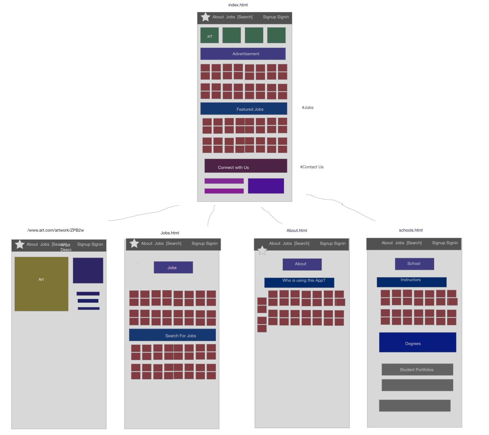
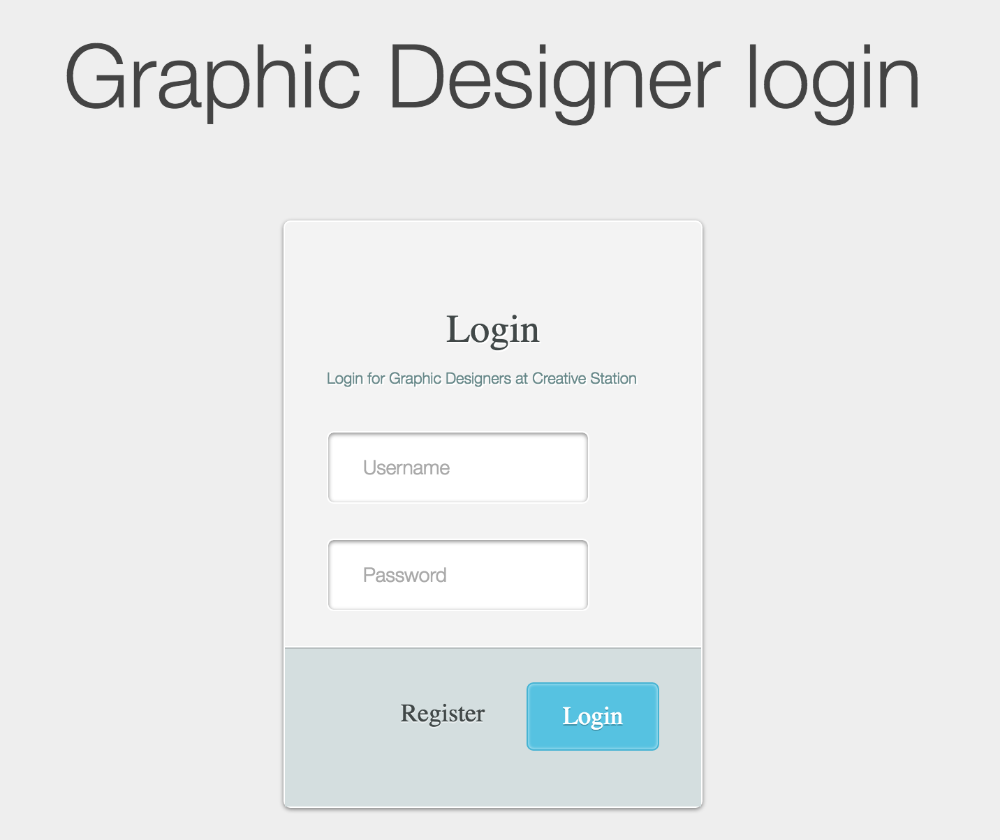
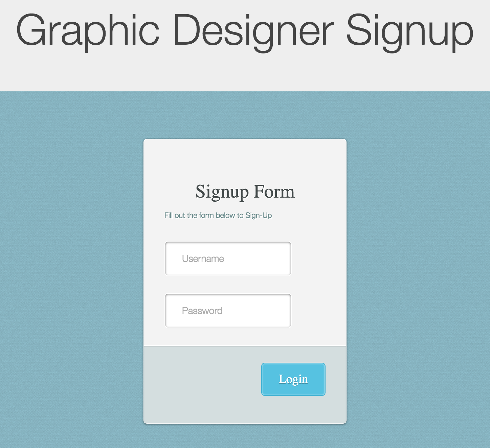

#Project 4 : Creative Station

##Trello Link

<A href="https://trello.com/b/zFyYOpsE/project-4"><h3>Trello</h3></a>
https://calm-retreat-74821.herokuapp.com/

### Description

Creative Station is a showcase platform for visual artist which include painters from a variety of different genres and mediums. This website would use the MEAN Stack and allow users to signup and upload their pictures and be able to comment on other people's artwork. Users are able to view schools in America that have imformation about M.F.A, M.A, B.F.A, and B.A programs for learning art and also information about the instructors teaching.

### Installation

Git clone the Repo. Start NPM install and run MongoDB

#### Technologies

* HTML
* CSS
* Node.js
* Angular
* MongoDB
* Express
* JSend
* Passport
* Bcrypt 
* Body-parser
* Cookie-parser
* Mongoose
* Path
* Bootstrap

### Unsolved Problems

* I would like to create individual profiles for Users and be able to comment on other people's work and be able to "Like" other peopels work.

### Demo Links

http://www.lindseyinteractive.com/wp-content/uploads/2015/08/creative_design_solutions.jpg

http://img10.deviantart.net/e3e8/i/2011/218/b/4/graphic_design_by_b1977-d45pn2h.jpg

http://www.bionicsisters.com/img/portfolio/gallery/Graphic-Design-Highres/Graphic-Design-Poster-Rock-Band-Girl-Leg.jpg

http://www.websiteinindia.com/wp-content/uploads/2013/02/Graphic_design.png
