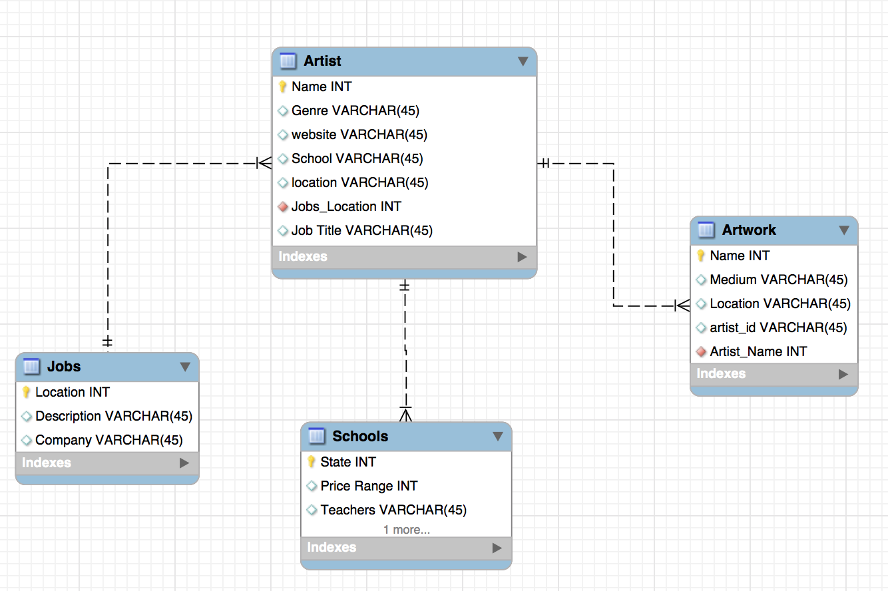

#Project 4 : Creative Station

##Trello Link

<A href="https://trello.com/b/zFyYOpsE/project-4"><h3>Trello</h3></a>
https://calm-retreat-74821.herokuapp.com/

### Description

Paintify is a showcase platform for visual artist which include painters from a variety of different genres and mediums. This website would use the MEAN Stack and allow users to signup and upload their pictures and be able to comment on other people's artwork. Users are able to view schools in America that have imformation about M.F.A, M.A, B.F.A, and B.A programs for learning art and also information about the instructors teaching.

I was thinking about using Ruby on Rails but I have to do some research. 

---

#### Friday, May 20th (9 AM) - Deliverables Due

- A Github repo with all instructors added as collaborators
- A readme.md in your repo
- A single paragraph description of what you want your project to be, and what technologies you plan to use
- A Trello board (that all of the instructors have been added to)
- User Stories written in the format "As a `<role>` I want `<feature>` so that `<reason>`"
- User stories organized into lists, for example:
 - Current (what you're currently working on)
 - Sprint (what you hope to have finished in this sprint, i.e. your MVP)
 - Backlog (your wishlist)
- ERD uploaded to your repo and linked to in your readme.md
- Wireframes uploaded to your repo and linked to in your readme.md

